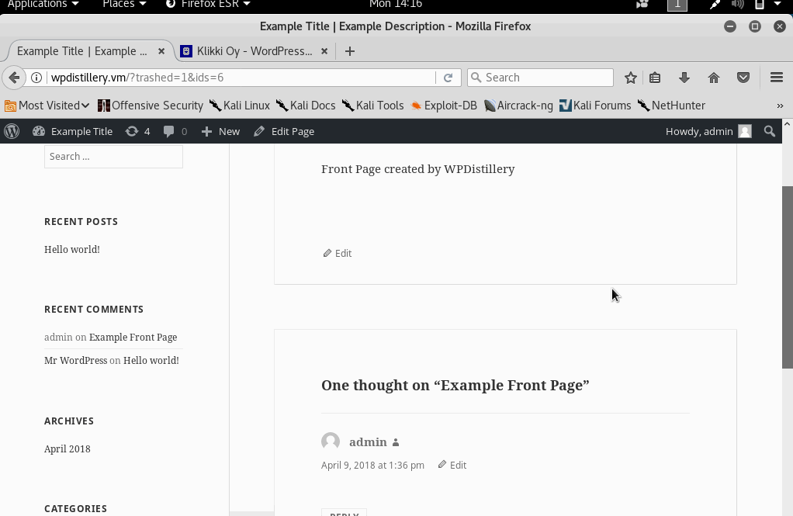
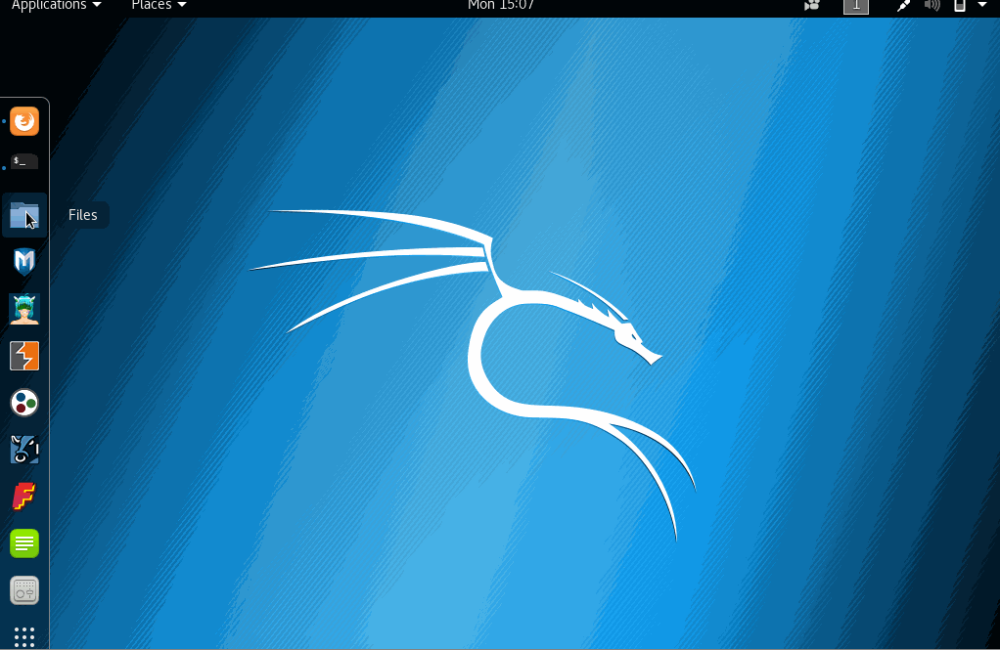

CodePath University's Web Security

# Project 7 - WordPress Pentesting

Time spent: **5** hours spent in total

> Objective: Find, analyze, recreate, and document **five vulnerabilities** affecting an old version of WordPress

## Pentesting Report

1. (Required) 4.2.2 - Authenticated Stored Cross-Site Scripting (XSS)
  - [x] Summary: A stored XSS vulnerability in WordPress allows an user with the posting capability to compromise the website.Under default configuration, the attack requires a Contributor or Author level account. The attacker would insert specially formatted HTML containing JavaScript on a WordPress page or post. Some special configurations may allow posting or editing page content for unauthenticated users.
    - Vulnerability types: 4.2~
    - Tested in version: 4.2
    - Fixed in version: 4.2.3
  - [x] GIF Walkthrough: 
    
  - [x] Steps to recreate: 
    1. Write any posts under author, contributor on any post.
    2. Write the following code in: `<a onmouseover= "alert('4.2.2 Authenticated Stored XSS Attack!')" > GET $$$$$$ NOW</a>`
  - [x] Affected source code:
  - [x] References:
    - [Klikki.fi](https://klikki.fi/adv/wordpress3.html)
2. (Required) 4.2.3 - Legacy Theme Preview Cross-Site Scripting (XSS) CVE-2015-5734
  - [x] Summary: This is a Cross-site scripting (XSS) vulnerability in the legacy theme preview implementation in wp-includes/theme.php in WordPress before 4.2.4 allows remote attackers to inject arbitrary web script or HTML via a crafted string.
    - Vulnerability types: 4.2~
    - Tested in version: 4.2
    - Fixed in version: 4.2.4
  - [x] GIF Walkthrough: 
    
  - [x] Steps to recreate: 
    1. Write any posts under author, contributor on any post.
    2. Write the following code in: `<a href='/wp-admin/' title="" style="position:absolute; top:0; left:0; width: 100%; height: 100%; display:block;" onmouseover=alert(1)//' rel="nofollow">XSS</a>` 
  - [x] Affected source code:
    - [Link 1](https://core.trac.wordpress.org/browser/tags/version/src/source_file.php)
  - [x] References:
    - https://wpvulndb.com/vulnerabilities/8133
    - https://core.trac.wordpress.org/changeset/33549
    - https://blog.sucuri.net/2015/08/persistent-xss-vulnerability-in-wordpress-explained.html
    - https://cve.mitre.org/cgi-bin/cvename.cgi?name=CVE-2015-5734
    
3. (Required) 4.0-4.7.2 - Authenticated Stored Cross-Site Scripting (XSS) in YouTube URL Embeds CVE-2015-6535
  - [x] Summary: This vulnerability exposes admins on multisite installs can inject arbitrary JavaScript into pages visible to super admins via the plugin's unsanitized profile name field. 
    - Vulnerability types: 4.0 - 4.7.2
    - Tested in version: 4.2
    - Fixed in version: 4.2.13
  - [x] GIF Walkthrough: 
    
  - [x] Steps to recreate: 
    1. Create a new post and embed a link
    2. Put the following XSS code in: `[embed src='https://youtube.com/embed/dfadfafdkladmfdafdfo\x3csvg onload=alert("4.2_Oversized_File_Upload_Error_XSS")\x3e'][/embed] `
  - [x] Affected source code:
    - [Link 1](https://core.trac.wordpress.org/browser/tags/version/src/source_file.php)
  - [x] References:
    - [Blog](https://blog.sucuri.net/2017/03/stored-xss-in-wordpress-core.html)
    - [CVE](https://cve.mitre.org/cgi-bin/cvename.cgi?name=CVE-2017-6817)
4. (Optional) 2.5-4.6 - Authenticated Stored Cross-Site Scripting via Image Filename CVE-2016-7168
  - [x] Summary: This is a persistent Cross-Site Scripting (XSS) vulnerability has been found in WordPress. An attacker can create a specially crafted image file name which, when uploaded in WordPress, injects malicious JavaScript code into the application. An attacker can use this vulnerability to perform a wide variety of actions, such as stealing victims' session tokens or login credentials, and performing arbitrary actions on their behalf.
    - Vulnerability types: 2.5 - 4.6
    - Tested in version: 4.2
    - Fixed in version: 4.2.10
  - [x] GIF Walkthrough: 
    
  - [x] Steps to recreate: 
    1. Go to the internet and find an image to upload.
    2. Change the .jpg or .png with the following script `DeluxKrabbyPatty.jpg`
    1. Create new media in library and upload the image.
    2. View attachment page to view the image post.
  - [x] Affected source code:
    - [Link 1](https://core.trac.wordpress.org/browser/tags/version/src/source_file.php)
  - [x] References:
  - https://sumofpwn.nl/advisory/2016/persistent_cross_site_scripting_vulnerability_in_wordpress_due_to_unsafe_processing_of_file_names.html
5. (Optional) 3.7-4.4 Authenticated Cross-Site Scripting (XSS) CVE-2016-1564
  - [x] Summary: This is a multiple cross-site scripting (XSS) vulnerabilities in wp-includes/class-wp-theme.php in WordPress before 4.4.1 allow remote attackers to inject arbitrary web script or HTML via a (1) stylesheet name or (2) template name to wp-admin/customize.php.
    - Vulnerability types: 3.7 - 4.4
    - Tested in version: 4.2
    - Fixed in version: 4.2.6
  - [x] GIF Walkthrough: 
    
  - [x] Steps to recreate: 
    1. Post the following XSS code into a comment or post
    2. ` http://wpdistillery.vm/<svg onload=alert(1)> `
  - [x] Affected source code:
    - [Link 1](https://core.trac.wordpress.org/browser/tags/version/src/source_file.php) 
  - [x] References:
    - [CVE](https://cve.mitre.org/cgi-bin/cvename.cgi?name=CVE-2016-1564)

## Assets

## Resources

- [WordPress Source Browser](https://core.trac.wordpress.org/browser/)
- [WordPress Developer Reference](https://developer.wordpress.org/reference/)

GIFs created with [LiceCap](http://www.cockos.com/licecap/).

## Notes

Describe any challenges encountered while doing the work

## License

    Copyright [2018] [Michelle Uy]

    Licensed under the Apache License, Version 2.0 (the "License");
    you may not use this file except in compliance with the License.
    You may obtain a copy of the License at

        http://www.apache.org/licenses/LICENSE-2.0

    Unless required by applicable law or agreed to in writing, software
    distributed under the License is distributed on an "AS IS" BASIS,
    WITHOUT WARRANTIES OR CONDITIONS OF ANY KIND, either express or implied.
    See the License for the specific language governing permissions and
    limitations under the License.
